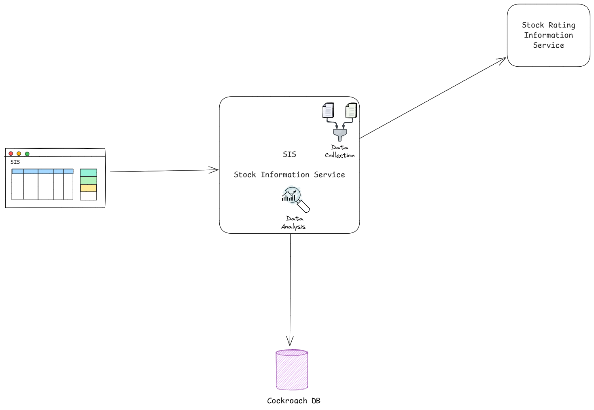
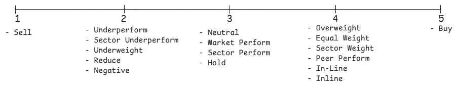

# Stock Rating System  
  
## Authors  
- [Rubén Padilla](https://github.com/rubenpad)   
  
## Overview  
  This document outlines the design and implementation plan for a stock information system. The system retrieves stock data from an external API, format it, stores in a Cockroach database and provide APIs to dispose the information to a web application. The system will have an algorithm that analyses the input data and scores each stock to classify them as a potential recommendations to invest in.
  
## Goals and Non-Goals  
### Goals  
- Provide a POST endpoint to trigger the process to fetch the stock data from the external service
- Fetch stock data from external API
- Format the data accordingly and stores it in a Cockroach database  
- Provide a GET endpoint to provide the stock data
- Provide a GET endpoint to provide details about a specific stock
- Create an algorithm that analyses the input data and set a score to the stocks so they can be classified as potential investments for the user
  
### Non-Goals  
- Get realtime data for the stocks
- Get the brokerage information
- Update or fetch the data periodically. It'll be fetched only calling the provided endpoint
  
## Detailed Design  

<p width="100%" align="center"></p>
  
### Data Models 

#### Stock detail
|field|type|description|
|-----|----|-----------|
|company|string|The name of the company|
|ticker|string|The company code stock|
|score|integer|Determines the puntuation for the stock to be recommended as good investment. The higher the value the better

Example:
```json
{
    "ticker": "RYN",
    "company": "Rayonier",
    "score": 7
}
```

#### Stock historic information
|field|type|description|
|-----|----|-----------|
|brokerage|string|The brockerage name|
|action|string|Determines the adjusment performed by the brockerage|
|company|string|The name of the company|
|ticker|string|The company code stock|
|rating_from|string|The prior rating|
|rating_to|string|The new rating|
|target_from|string|The prior target price
|target_to|string|The new target price
|time|string|The date of the brokerage action in ISO format
|target_price_change|double|Measures the percentage change between target_from and target_to

Example:
```json
{
    "ticker": "RYN",
    "target_from": "$33.00",
    "target_to": "$30.00",
    "company": "Rayonier",
    "action": "target lowered by",
    "rating_to": "Sector Perform",
    "rating_from": "Sector Perform",
    "brokerage": "Royal Bank of Canada",
    "time": "2025-02-09T00:30:05.873242012Z",
    "target_price_change": 0.36
}
```

### Stock analysis algorith definition

The scoring for the stock recommendation system will be based on the next scale:

<p width="100%" align="center"></p>

#### Key elements of the algorithm

#### Actions
  -  reiterated by
  -  target lowered by
  -  upgraded by
  -  target raised by
  -  initiated by
  -  target set by
  -  downgraded by

#### Categorized Ratings

##### Strong buy (Bullish)
  - Strong-Buy
  - Buy
  - Top Pick
  - Positive
  - Outperform
  - Market Outperform
  - Sector Outperform
  - Outperformer

###### Buy (Moderatelly bullish)
  - Overweight
  - Equal Weight
  - Sector Weight
  - Peer Perform
  - In-Line
  - Inline

##### Hold (Neutral)
  - Neutral
  - Market Perform
  - Sector Perform
  - Hold

##### Sell (Moderatelly bearish)
  - Underperform
  - Sector Underperform
  - Underweight
  - Reduce
  - Negative

##### Strong Sell (Bearish)
  - Sell
