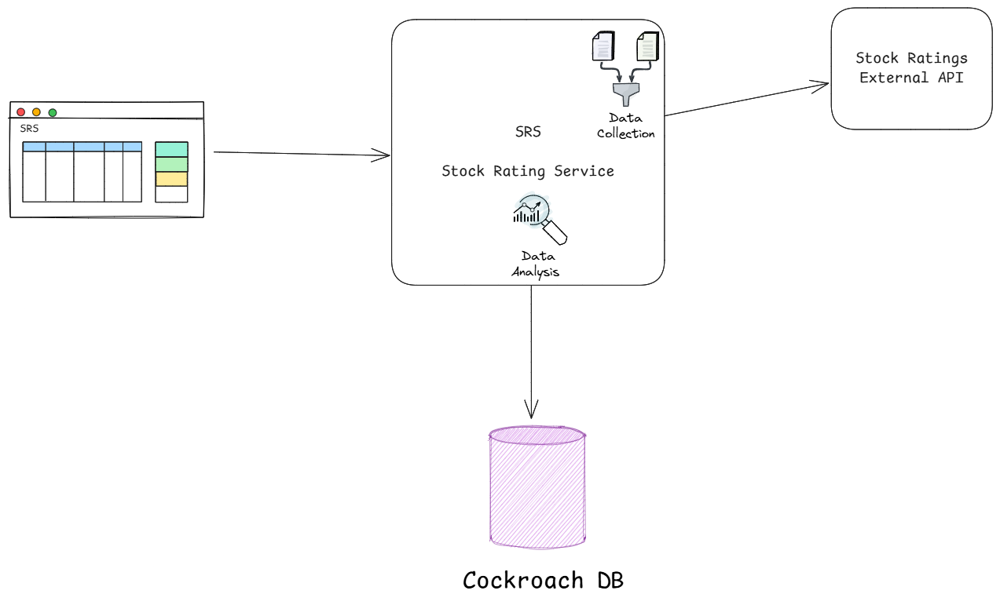

# Documentation for the stock rating system (SRS)
  
## Authors  
- [Rubén Padilla](https://github.com/rubenpad)   
  
## Overview  
  This document outlines the design and implementation plan for a stock information system. The system retrieves stock data from an external API, format it, stores in a Cockroach database and provide APIs to dispose the information to a web application. The system will have an algorithm that analyses the input data and scores each stock to classify them as potential recommendations to invest in.
  
## Goals and Non-Goals  
### Goals  
- Provide a POST endpoint to trigger the process to fetch the stock data from the external service
- Fetch stock data from external API
- Format the data accordingly and stores it in a Cockroach database  
- Provide a GET endpoint to provide the stock data
- Provide a GET endpoint to provide details about a specific stock
- Create an algorithm that analyses the input data and set a score to the stocks so they can be classified as potential investments for the user
- Create a Vue SPA wit the UI to display the stock ratings data and the recommended stocks.
  
### Non-Goals  
- Get realtime data for the stocks
- Get the brokerage information
- Update or fetch the data periodically. It'll be fetched only calling the provided endpoint
  
## Detailed Design  

<p width="100%" align="center"></p>
  
### Data Models 

#### Stock ratings (stock_rating)
|field|type|description|
|-----|----|-----------|
|brokerage|string|The brockerage name|
|action|string|Determines the adjusment performed by the brockerage|
|company|string|The name of the company|
|ticker|string|The company code stock|
|rating_from|string|The prior rating|
|rating_to|string|The new rating|
|target_from|string|The prior target price
|target_to|string|The new target price
|time|string|The date of the brokerage action in ISO format
|target_price_change|double|Measures the percentage change between target_from and target_to
|score|double|Value calculate by the stock recommendation algorithm

Example:
```json
{
    "ticker": "RYN",
    "target_from": "$33.00",
    "target_to": "$30.00",
    "company": "Rayonier",
    "action": "target lowered by",
    "rating_to": "Sector Perform",
    "rating_from": "Sector Perform",
    "brokerage": "Royal Bank of Canada",
    "time": "2025-02-09T00:30:05.873242012Z",
    "target_price_change": 0.36,
    "score": 4.5
}
```

### Stock analysis algorithm definition
In this section describes the elements used in the scoring and how they apply to the stock rating. Some elements are not standard and posible variations depend on the brokerage.

The scoring for the stock recommendation system will be based on the next scale:

<p width="100%" align="center"></p>

#### Key elements of the algorithm

When the service fetchs the data it applies the scoring algorithm to determine the value of the `score` field. The final recommendations result will be calculated using a SQL query.

##### Table of weights
|field|weight|description|
|-----|------|-----------|
|rating|50%|The system check if the rating was upgraded or downgraded based on the values of `rating_from` and `rating_to`. Upgrades get a greater score than downgrades.|
|brokerage action|25%|Upgrade actions get a greater score than downgrade actions. `reiterated by` and `target set by` are special cases because depend on what the new rating is. Combination with bullish ratings get greater score than the bearish ones.|
|current target|15%|Bullish targets get better score than bearish ones.|
|target price change|5%|Greater % price change gets better score.|
|report date|5%|Stocks with recent reports get better score.|

#### Ratings by category

##### Strong buy (Bullish)
  - Strong-Buy
  - Buy
  - Top Pick
  - Positive
  - Outperform
  - Market Outperform
  - Sector Outperform
  - Outperformer

###### Buy (Moderatelly bullish)
  - Overweight
  - Equal Weight
  - Sector Weight
  - Peer Perform
  - In-Line
  - Inline

##### Hold (Neutral)
  - Neutral
  - Market Perform
  - Sector Perform
  - Hold

##### Sell (Moderatelly bearish)
  - Underperform
  - Sector Underperform
  - Underweight
  - Reduce
  - Negative

##### Strong Sell (Bearish)
  - Sell

#### Brokerage actions

  -  upgraded by
  -  target raised by
  -  initiated by
  -  reiterated by (special case)
  -  target set by (special case)
  -  downgraded by
  -  target lowered by
